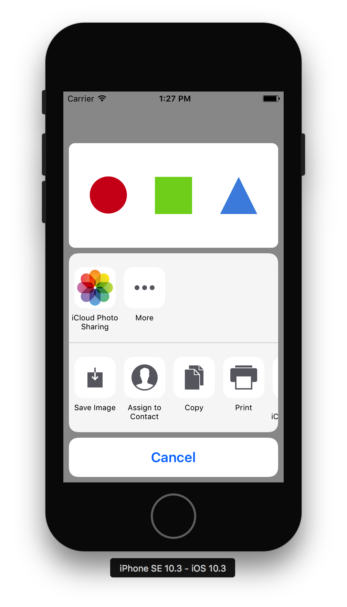

# PreviewableActivityViewController

[](https://travis-ci.org/Kane Cheshire/PreviewableActivityViewController)
[](http://cocoapods.org/pods/PreviewableActivityViewController)
[](http://cocoapods.org/pods/PreviewableActivityViewController)
[](http://cocoapods.org/pods/PreviewableActivityViewController)



## Usage

Default usage is no different from the regular `UIActivityViewController` . The controller will automatically try to populate the preview image view from the images you provide at initialisation time:

```swift
let controller = PreviewableActivityViewController(activityItems: [#imageLiteral(resourceName: "example")])
present(controller, animated: true)
```

You can optionally customise things like the aspect ratio of the preview image (defaults to 2:1). If you change this aspect ratio, be mindful of running out of space on smaller screens, AirDrop takes up a lot of space.

## Requirements

## Installation

PreviewableActivityViewController is available through [CocoaPods](http://cocoapods.org). To install
it, simply add the following line to your Podfile:

```ruby
pod 'PreviewableActivityViewController'
```

## Author

Kane Cheshire,

## License

PreviewableActivityViewController is available under the MIT license. See the LICENSE file for more info.
